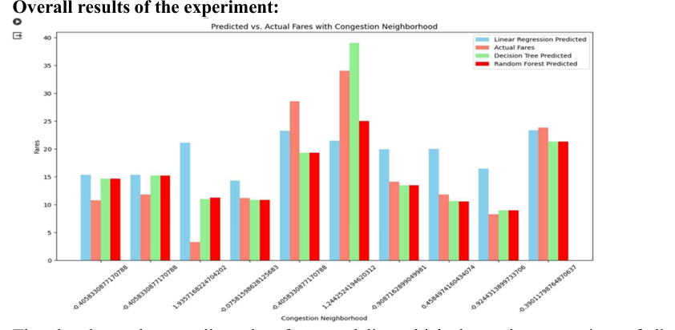

# NYC Green Taxi Fare Prediction and Congestion Impact Analysis  
**A Geospatial Machine Learning Project | Kent State University Capstone**

##  Overview
This project investigates how **traffic congestion** impacts **taxi fare prices and trip durations** across different neighborhoods and time windows in New York City. Developed as part of a university capstone at Kent State, the study explores spatial-temporal congestion patterns and builds machine learning models to predict total fare amounts.

We used historical **NYC Green Taxi Trip Data (2022)** and applied regression-based models to understand and quantify the effect of congestion across zones.

---

##  Business Objective
The project addresses this core question:

> **How does traffic congestion affect trip duration and taxi fares across NYC neighborhoods and times of day?**

This has practical implications for:
- **Urban planners** to reduce congestion hotspots
- **Taxi operators** to reroute and optimize pricing
- **Passengers** to make informed travel decisions

---

##  Key Techniques & Methodology

| Stage                  | Approach                                                                 |
|------------------------|--------------------------------------------------------------------------|
| Data Collection        | Imported NYC Green Taxi 2022 dataset                                     |
| Data Processing        | Cleaned timestamps, extracted trip metrics, mapped congestion zones      |
| Spatial Analysis       | Identified zones with highest average fare and trip time                 |
| Temporal Analysis      | Visualized hourly variations in fare, duration, congestion surcharge     |
| Feature Engineering    | Created distance, duration, and surcharge-based features                 |
| Modeling Approaches    | Linear Regression, Decision Tree, Random Forest                          |
| Evaluation Metrics     | MSE, MAE, R² Score                                                        |
| Model Comparison       | Random Forest yielded the best performance (lowest MSE, highest R²)      |

---

##  Sample Insights

- Neighborhoods like zone `82`, `153`, and `191` had the **highest congestion-related fare increases**
- Congestion surcharge had a **moderate correlation** with total fare, but weak correlation with trip duration
- Fares and trip times **peaked during evening rush hours**, especially on weekdays

---

##  Models & Results

| Model            | MSE      | MAE     | R² Score |
|------------------|----------|---------|----------|
| Linear Regression| High     | High    | Low      |
| Decision Tree    | Moderate | Moderate| ~0.32    |
| Random Forest    | **Lowest**| Best   | Best     |

Random Forest achieved the best predictive accuracy by capturing non-linear interactions between congestion zones and fare pricing.

---
##  Visual Results

Below are key visualizations from the modeling phase:

*Comparison of predicted vs. actual fares across congestion-heavy neighborhoods.*

*Random Forest delivered the best performance with the lowest MSE and highest explanatory power (R² = 0.49).*

---
##  Individual Contributions

- **Mukthasree Vengoti**: Led the **spatial and temporal congestion analysis**, identified peak-hour congestion zones and modeled temporal fare patterns.
- Jaladurgam Navya: Focused on congestion-fare relationship across neighborhoods
- Aravind Reddy Thummala: Built and optimized ML models for fare prediction

---

##  Project Structure
NYC--Green--Tax--Data--Data-Science-Project/
├── Capstone_Project_Code_Group_5.ipynb # Full notebook with all EDA & modeling
├── Group_5_Capstone_report.pdf # Full report with figures and findings

##  Report & GitHub

-  [Full Report (PDF)](./Group_5_Capstone_report.pdf)
-  [View Full Code Notebook](./Capstone_Project_Code_Group_5.ipynb)

---

##  Real-World Relevance

This project mimics real industry use cases like:

- **Fare estimation engines** used by Uber, Lyft, Ola, etc.  
- **Traffic congestion impact analysis** for smart cities and government planning  
- **Dynamic pricing and zone-based fare modeling** used by taxi operators  
- **Geospatial analytics** to identify high-risk or high-demand areas for better fleet routing

By integrating congestion, time-of-day, and location-based features, the model reflects real-world complexities seen in urban transport systems.

---

##  Key Learning Outcomes

- Developed real-world machine learning pipeline on open data
- Interpreted spatial and temporal trends for urban impact
- Compared models using evaluation metrics and explained results using visuals
- Demonstrated individual responsibility in a team-based academic project

---

###  Top Predictive Features (Random Forest)

- Trip Distance  
- Duration  
- Congestion Surcharge  
- Pickup Hour  
- Dropoff Location ID  

---

##  Keywords
`NYC Taxi`, `Traffic Congestion`, `Random Forest`, `Geospatial ML`, `Regression`, `Capstone`, `Time Series`, `Python`, `Pandas`, `Matplotlib`, `Scikit-learn`

---

##  Citation

This project was submitted as part of the **MS in Data Science Capstone (Spring 2024)** at **Kent State University**.
